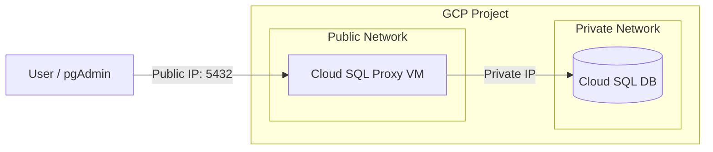

# Cloud SQL Proxy Access Module

This module provides a fully automated, "lift-and-shift" solution to securely access your private Cloud SQL instance from the public internet (e.g., for pgAdmin).

## Architecture

The solution deploys a lightweight **Dual-NIC VM** that bridges your public connection to the private database network.



### Key Features
*   **Dual-NIC Architecture**: One interface for public access, one for private DB communication.
*   **Static Public IP**: The proxy gets a permanent IP address (`35.226.231.27`) that survives VM recreation.
*   **Automated Routing**: Startup scripts automatically configure routing tables to ensure traffic flows correctly through the private interface.
*   **Automated User Management**: Terraform automatically creates a dedicated DB user (`postgres_user`) so you don't need to manage passwords manually.
*   **Self-Healing**: The proxy runs as a systemd service and restarts automatically.

## Prerequisites

*   Existing Cloud SQL instance (deployed via `../infra`).
*   Terraform installed.
*   `gcloud` CLI authenticated.

## Deployment

This entire setup is managed as code. To deploy or update:

1.  **Navigate to the folder**:
    ```bash
    cd cloudsql
    ```

2.  **Initialize and Apply**:
    ```bash
    terraform init
    terraform apply
    ```

That's it! Terraform will handle:
*   Creating the VM and Networking.
*   Setting up the Service Account.
*   Creating the `postgres_user` in the database.
*   Configuring the VM internals.

## Connection Details

Once deployed, use the following details to connect from **pgAdmin** or any PostgreSQL client:

| Parameter | Value |
|-----------|-------|
| **Host** | `35.226.231.27` |
| **Port** | `5432` |
| **Database** | `jupyterhub_db` |
| **Username** | `postgres_user` |
| **Password** | `postgres` |
| **SSL Mode** | `Prefer` |

> **Note**: The password `postgres` is the default set in `variables_db.tf`. You can change it there if needed.

## Security Configuration

### Firewall
By default, the firewall allows connections from **any IP** (`0.0.0.0/0`) for ease of setup.
**Recommendation**: For production security, restrict this to your specific IP address.

1.  Edit `terraform.tfvars`:
    ```hcl
    allowed_ips = ["YOUR_PUBLIC_IP/32"]
    ```
2.  Run `terraform apply`.

### Service Account
The proxy uses a dedicated service account (`cloudsql-proxy@...`) with minimal permissions:
*   `roles/cloudsql.client`
*   `roles/cloudsql.instanceUser`

## Troubleshooting

**If you cannot connect:**

1.  **Check the Proxy Status**:
    SSH into the VM and check the service logs:
    ```bash
    gcloud compute ssh cloudsql-proxy-vm --zone=us-central1-a
    sudo systemctl status cloud-sql-proxy
    sudo journalctl -u cloud-sql-proxy -f
    ```

2.  **Verify Routing**:
    Ensure the static route to the private network exists:
    ```bash
    ip route
    # Should see a route for 10.0.0.0/8 via 192.168.0.1
    ```

3.  **Test Connectivity Locally**:
    From within the VM, try to connect to the DB IP:
    ```bash
    nc -zv 10.37.0.3 5432
    ```

## Files Structure

*   `main.tf`: Core infrastructure (VM, Network, Firewall, DB User).
*   `variables.tf` & `variables_db.tf`: Configuration inputs.
*   `outputs.tf`: Useful connection info displayed after deployment.
*   `startup-script.sh.tftpl`: Boot script for VM configuration.
